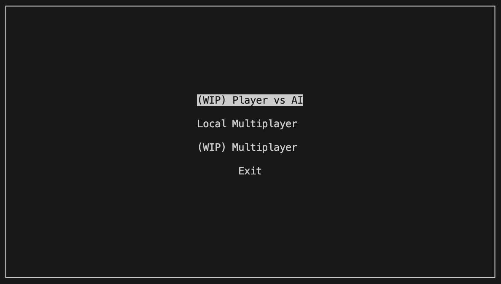

# ASCII Combat
## Project overview
Terminal fighting game written in C++ using ncurses library for graphics.
Characters are modeled and animated using developed ASCII art.
The project is a simple combat game.
For graphics I used ncurses library and developed ASCII art characters.
The game implements simple UI.
For the purpose of loading assets I developed simple markup language.

## Building the project
Project can be built using a `built.sh` script which is a simple wrapper
for Bazel CLI.

### Linux
Release
```
./build.sh gcc opt
```
Debug
```
./build.sh gcc dbg
```

### Mac OS
Release
```
./build.sh clang opt
```
Debug
```
./build.sh clang dbg
```

## How to run
To start the game simply run:
```
./bazel-bin/ascii-combat
```
You will be welcomed with this simple menu.



> **_NOTE:_**  SINGLEPLAYER mode is not currently implemented.

### Multiplayer mode
In multiplayer mode players play using the same keyboard. *Player1* (on the left) is using WSAD keys. *Player2* controls the character with arrows.

Controls:
* up: jump;
* down: attack;
* left: go left;
* right: go right;


At any time you can pause/exit the game by pressing `q`.

## Development
## Lint
To lint the project run:
```
./lint.sh
```
Configured linters:
* cppcheck
* cpplint
* clang-tidy

## Apply fixes
To automatically apply code fixes run:
```
./fix.sh
```
This will format the code, apply fixes from clang-tidy and automatically
add missing copyright clauses.

## Markup language
For the purpose of loading assets simple markup language was implemented.
### How it works
First it looks for name tag (f.e. Map, Player).
Then if it's Map, algorithms is as follows:
* read lines of map until EOM markup
* save map
For Player: (read animations)
* read number (it's number of animation frames)
* read lines of animation's frame until EFM (end of frame) markup
* jump to first instruction and repeat until EOC markup(end of clip)
* jump to first instruction and repeat until EOA (end of animation)
* read animations until END markup

Parsing finishes when EOF is found

## Troubleshooting
### macOS disallows loading of dynamic libraries
Remove quarantine for following files:
* libsfml-system.2.6.dylib
* libsfml-system.2.6.1.dylib
* libsfml-window.2.6.dylib
* libsfml-window.2.6.1.dylib
```
sudo xattr -d com.apple.quarantine <file>
```

## TODOs
### Small
* Use Bazel's `select` to differentiate between platform.
* Rename targets to <os>-<compiler>-<arch>, e.g. macOS-clang-arm64, linux-gcc-x86.

### Medium
* Create a CI.
* Add GTest.
* Modernize the code.
* Implement simple event system.
* Test and refactor assets module.
* Add more weapons.

### Big
* Implement networking based on Protobufs.
* Implement a simple AI bot.
* Package the app.

### Optional
* Add simple audio effects.
