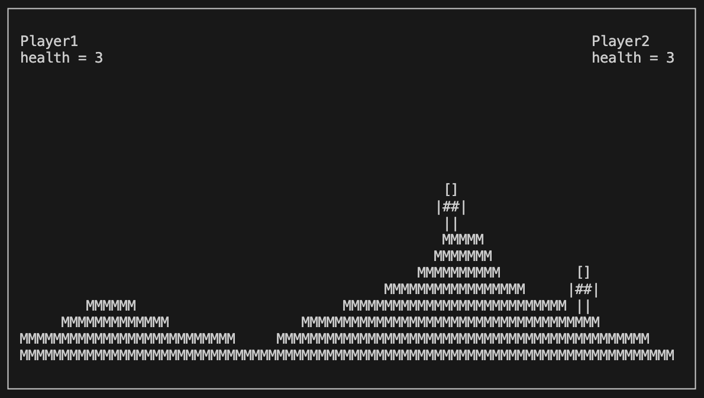

# ASCII Combat
## Project overview
Terminal fighting game written in C++ using ncurses library for graphics.
Characters are modeled and animated using developed ASCII art.
The project is a simple combat game.
For graphics I used ncurses library and developed ASCII art characters.
The game implements simple UI.
For the purpose of loading assets I developed simple markup language.



## Building the project
```
mkdir build
cd build
cmake ..
make
```
This should result in a binary named ConsoleGame.
It is important that asset files are in the same directory as the binary.

## Markup language
For the purpose of loading assets simple markup language was implemented.
### How it works
First it looks for name tag (f.e. Map, Player).
Then if it's Map, algorithms is as follows:
* read lines of map until EOM markup
* save map
For Player: (read animations)
* read number (it's number of animation frames)
* read lines of animation's frame until EFM (end of frame) markup
* jump to first instruction and repeat until EOC markup(end of clip)
* jump to first instruction and repeat until EOA (end of animation)
* read animations until END markup

Parsing finishes when EOF is found
